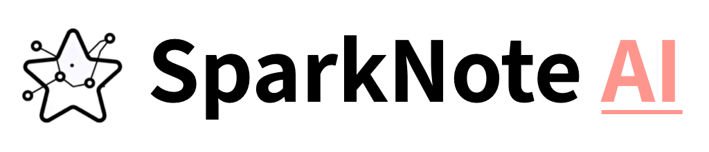
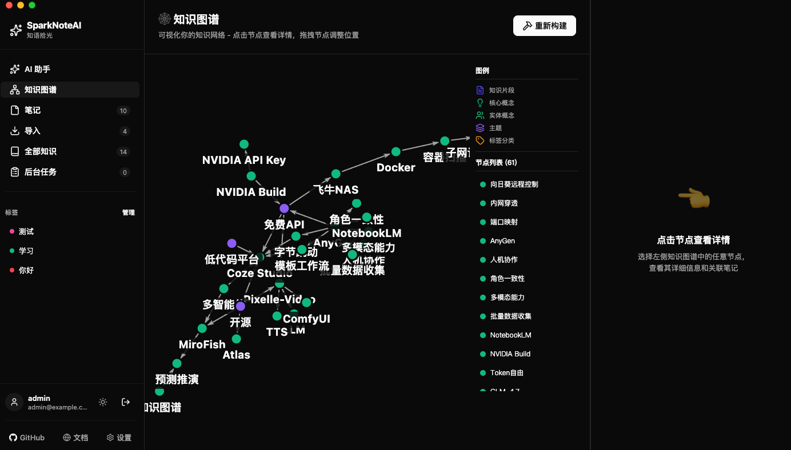
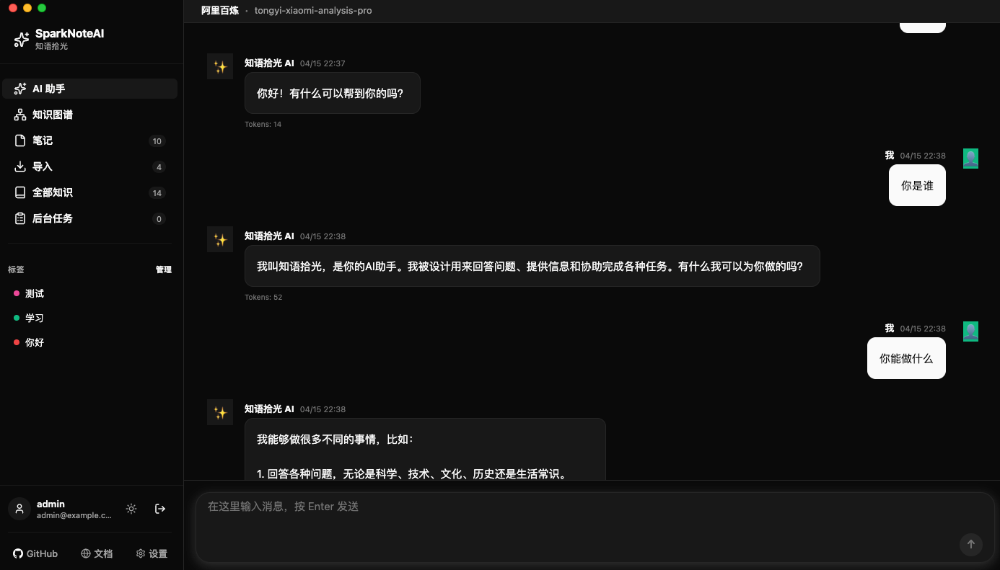
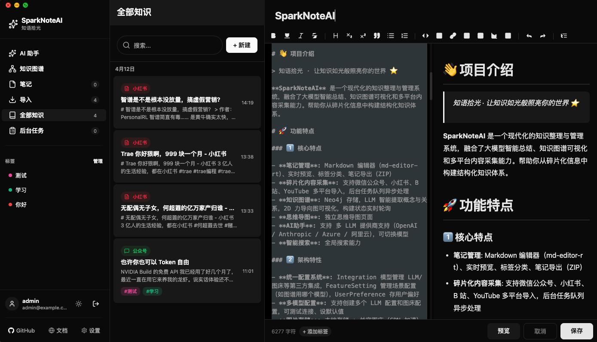
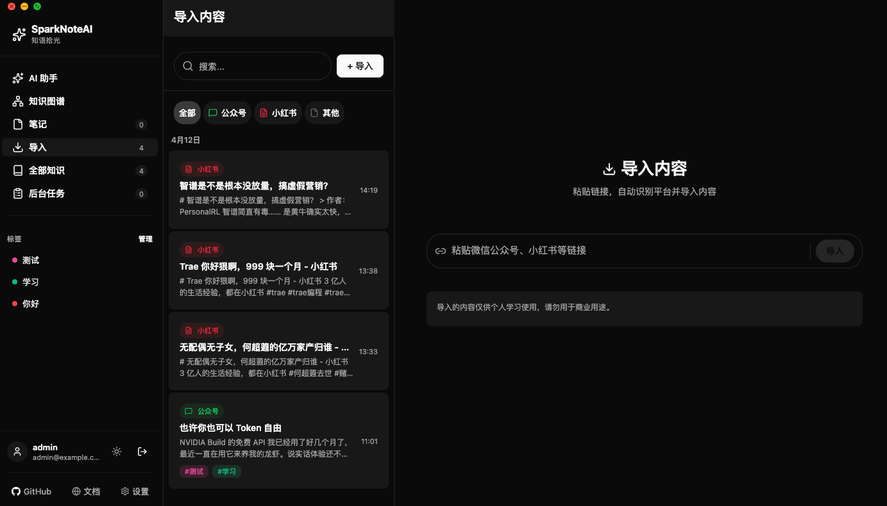
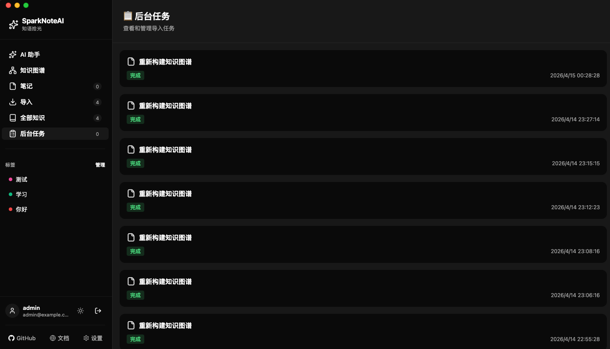
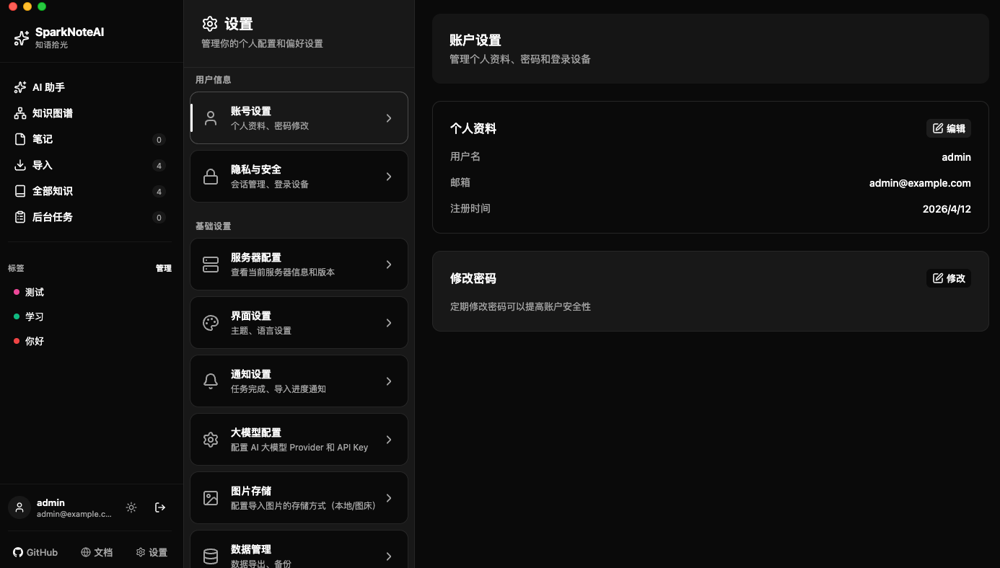

<p align="center">
  
</p>

<p align="center">
  <a href="https://github.com/sparknoteai/SparkNoteAI">
    
  </a>
  <a href="https://github.com/sparknoteai/SparkNoteAI/blob/main/LICENSE">
    
  </a>
  <a href="https://www.python.org/downloads/">
    
  </a>
  <a href="https://nodejs.org/">
    
  </a>
  <a href="https://github.com/sparknoteai/SparkNoteAI/stargazers">
    
  </a>
</p>

<p align="center">
  <a target="_blank" href="https://spark-ai-boy.github.io">📖 官方网站</a> &nbsp; | &nbsp;
  <a target="_blank" href="https://spark-ai-boy.github.io/docs/intro">文档</a> &nbsp;
</p>


# 👋 项目介绍

> 知语拾光 · 让知识如光般照亮你的世界 ⭐️

**SparkNoteAI** 是一个现代化的知识整理与管理系统，融合了大模型智能总结、知识图谱可视化和多平台内容采集能力。帮助你从碎片化信息中构建结构化知识体系。

# 🚀 功能特点

### 1️⃣ 核心特点

- **笔记管理**: Markdown 编辑器（md-editor-rt）、实时预览、标签分类、笔记导出（ZIP）
- **碎片化内容采集**: 支持微信公众号、小红书、B 站、YouTube 多平台导入，后台任务队列异步处理
- **知识图谱**: Neo4j 存储，LLM 智能提取概念与关系，2D 力导向图可视化，构建状态实时轮询
- **思维导图**: 独立思维导图页面
- **AI助手**: 支持 多 LLM 提供商支持（OpenAI / Anthropic / Azure / 阿里云），可切换模型
- **智能搜索**: 全局搜索能力

### 2️⃣ 架构特性  

- **统一配置系统**: Integration 模型管理 LLM/图床等第三方集成，FeatureSetting 管理场景配置（如图谱用哪个模型），UserPreference 存用户偏好
- **多模型配置**: 支持创建多个 LLM 配置和图床配置，可测试连接、设默认值
- **图片存储**: 本地存储 + 兰空图床（CDN 加速）可切换
- **后台任务调度**: Redis-backed 任务队列，支持导入任务异步执行与状态跟踪 

### 3️⃣ 平台与安全

- **多端支持**: 支持 Web / iOS / Android / Electron 桌面端，token 存储自动适配（localStorage vs SecureStore）
- **认证**: OAuth2 + JWT 认证 — 7 天 token 有效期，TOTP 双因素认证支持
- **隐私与安全**: 独立隐私安全设置页面
- **主题切换**: 明暗主题，界面设置可配置


# 👉 功能演示

### 1️⃣ 知识图谱



### 2️⃣ AI助手



### 3️⃣ 笔记功能



### 4️⃣ 导入功能



### 5️⃣ 后台任务



### 6️⃣ 设置中心



# 🚀 快速开始（Docker 部署）

### 1. 克隆项目

```bash
git clone https://github.com/sparknoteai/SparkNoteAI.git
cd SparkNoteAI
```

### 2. 配置环境变量

```bash
cd docker
cp .env.example .env
```

编辑 `.env`，修改以下必填项：

| 变量 | 说明 |
|------|------|
| `APP_VERSION` | 版本号 |
| `POSTGRES_USER` | 数据库用户名 |
| `POSTGRES_PASSWORD` | 数据库密码 |
| `POSTGRES_DB` | 数据库名 |
| `REDIS_PASSWORD` | Redis 密码 |
| `NEO4J_PASSWORD` | Neo4j 密码 |
| `SECRET_KEY` | JWT 密钥（`openssl rand -hex 32` 生成） |
| `ENCRYPTION_KEY` | 加密密钥（`openssl rand -base64 32` 生成） |
| `COMPATIBLE_CLIENT_VERSIONS` | 兼容的客户端列表 |
| `ADMIN_USERNAME` | 管理员账号 |
| `ADMIN_PASSWORD` | 管理员密码 |
| `ADMIN_EMAIL` | 管理员邮箱 |

### 3. 启动服务

```bash
docker compose up -d
```

部署脚本会自动启动所有服务并初始化数据库。

### 4. 访问应用

| 服务 | 地址 |
|------|------|
| 前端 | http://your-server-ip |
| 后端 API | http://your-server-ip:8000 |
| Swagger UI | http://your-server-ip:8000/docs |

默认管理员账号：`admin` / 你在配置中设置的密码

# 💻 开发指南

### 环境要求

- **Node.js** >= 18
- **Python** >= 3.11
- **Docker** & **Docker Compose**（运行基础设施）

### 1. 启动基础设施

```bash
# 启动 PostgreSQL + Redis + Neo4j
npm run docker:dev:up

# 查看日志
npm run docker:dev:logs
```

基础设施运行在 Docker 中，端口映射：

| 服务 | 端口 |
|------|------|
| PostgreSQL | 5432 |
| Redis | 6379 |
| Neo4j | 7474 (浏览器) / 7687 (Bolt) |

### 2. 启动后端

```bash
# 安装依赖
cd apps/backend
python -m venv .venv
source .venv/bin/activate
pip install -r requirements.txt

# 启动（热重载）
npm run dev:backend
```

后端启动后会自动创建数据库表和默认管理员账号（`admin/admin123`）。

- **API**: http://localhost:8000
- **Swagger**: http://localhost:8000/docs

### 3. 启动前端

```bash
# 安装依赖（根目录或 apps/frontend）
npm run install:all

# 启动 Expo Metro
npm run dev:frontend
```

启动后可以选择：
- 按 `w` 在浏览器中打开 Web 版
- 扫码在手机上预览（iOS/Android）
- 桌面端运行 `npm run electron:dev`

### 同时启动

```bash
# 手动并发启动后端 + 前端
npm run dev:backend & npm run dev:frontend
```

### 常用开发命令

```bash
npm run test:backend          # 运行后端测试
npm run lint                  # TypeScript 类型检查
npm run build:frontend        # 前端 Web 构建
npm run docker:dev:down       # 停止基础设施
npm run electron:build:mac    # 构建桌面应用（macOS）
npm run electron:build:win    # 构建桌面应用（Windows）
```

# ⚠️ 免责声明

1. **使用风险自负**：使用本项目的风险完全由使用者自行承担。因使用本项目而导致的任何数据丢失、系统故障、业务中断或其他损害，项目作者及贡献者不承担任何责任。

2. **数据安全责任**：使用者应自行负责其存储的数据安全，包括但不限于：妥善保管 JWT 密钥（SECRET_KEY）、加密密钥（ENCRYPTION_KEY）、数据库密码及第三方 API Key。建议定期备份数据库，并在生产环境中启用 HTTPS。

3. **第三方服务风险**：本项目支持接入第三方 LLM（如 OpenAI、Anthropic 等）和图床服务。使用者应自行评估第三方服务的安全性、隐私政策和合规性。因第三方服务导致的数据泄露、内容审查或其他问题，本项目不承担责任。

4. **内容合规**：使用者通过本项目存储、处理和展示的内容（包括笔记、导入的碎片化内容、知识图谱等）需遵守当地法律法规，不得用于违法用途。因内容违规导致的任何法律责任由使用者自行承担。

5. **非生产级保证**：本项目仍在持续开发迭代中，可能存在未发现的 Bug 或安全漏洞。建议在部署到生产环境前进行充分的安全审计和测试。

6. **开源许可证**：本项目采用 AGPL-3.0 许可证。使用者需遵守许可证要求，特别是通过网络提供服务的修改版本也必须以相同许可证开放源码。

---

# 👥 社区

- 🐛 问题反馈：[GitHub Issues](https://github.com/sparknoteai/SparkNoteAI/issues)


# 🙏 致谢

感谢以下开源项目与技术：

**后端框架与服务**

- [FastAPI](https://fastapi.tiangolo.com/) - 现代高性能 Python Web 框架 (MIT)
- [Uvicorn](https://www.uvicorn.org/) - ASGI 服务器 (BSD)
- [SQLAlchemy](https://www.sqlalchemy.org/) - Python ORM 框架 (MIT)
- [Pydantic](https://docs.pydantic.dev/) - 数据验证与配置管理 (MIT)
- [python-jose](https://python-jose.readthedocs.io/) - JWT 认证支持 (MIT)
- [bcrypt](https://github.com/pyca/bcrypt/) - 密码加密 (Apache-2.0)
- [httpx](https://www.python-httpx.org/) - HTTP 客户端 (BSD)

**数据库与缓存**

- [PostgreSQL](https://www.postgresql.org/) - 关系型数据库
- [Redis](https://redis.io/) - 内存数据库与缓存
- [Neo4j](https://neo4j.com/) - 图数据库
- [psycopg2](https://www.psycopg.org/) - PostgreSQL 驱动 (LGPL)

**前端框架与组件**

- [React Native](https://reactnative.dev/) - 跨平台移动应用开发 (MIT)
- [Expo](https://expo.dev/) - React Native 开发工具 (MIT)
- [React Navigation](https://reactnavigation.org/) - 路由导航库 (MIT)
- [Zustand](https://github.com/pmndrs/zustand) - 轻量状态管理 (MIT)
- [Axios](https://axios-http.com/) - HTTP 客户端 (MIT)

**编辑器与可视化**

- [md-editor-rt](https://github.com/imzbf/md-editor-rt) - Markdown 编辑器 (MIT)
- [react-force-graph](https://github.com/vasturiano/react-force-graph) - 力导向图可视化 (MIT)
- [react-syntax-highlighter](https://github.com/react-syntax-highlighter/react-syntax-highlighter) - 代码高亮 (MIT)

**图标与设计**

- [Lucide Icons](https://lucide.dev/) - 统一图标库 (ISC)

**桌面端**

- [Electron](https://www.electronjs.org/) - 跨平台桌面应用框架 (MIT)

---

# 📝 许可证

本项目采用 **AGPL-3.0** 许可证开源。

详见 [LICENSE](./LICENSE) 文件。

---

<p align="center">
  <strong>如果这个项目对你有帮助，请给一个 ⭐️ Star 支持！</strong>
</p>

<p align="center">
  Made with ❤️ by SparkNoteAI Team
</p>

## Star History

[](https://www.star-history.com/#spark-ai-boy/SparkNoteAI&Date)
